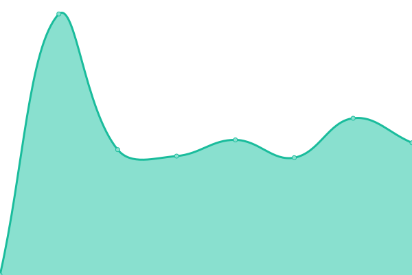

# [📈 Live Status](https://upd-uptime.github.io/upd-uptime): <!--live status--> **🟩 All systems operational**

This repository contains the open-source uptime monitor and status page for [UPD](https://upd.edu.ph), powered by [Upptime](https://github.com/upptime/upptime).

With [Upptime](https://upptime.js.org), you can get your own unlimited and free uptime monitor and status page, powered entirely by a GitHub repository. We use [Issues](https://github.com/heygsiri/upd-uptime/issues) as incident reports, [Actions](https://github.com/upd-uptime/upd-uptime/actions) as uptime monitors, and [Pages](https://upd-uptime.github.io/upd-uptime) for the status page.

<!--start: status pages-->
<!-- This summary is generated by Upptime (https://github.com/upptime/upptime) -->
<!-- Do not edit this manually, your changes will be overwritten -->
<!-- prettier-ignore -->
| URL | Status | History | Response Time | Uptime |
| --- | ------ | ------- | ------------- | ------ |
|  [UVLe](https://uvle.upd.edu.ph) | 🟩 Up | [uv-le.yml](https://github.com/upd-uptime/upd-uptime/commits/HEAD/history/uv-le.yml) | 

 6586ms
     
 | 

<a href="https://upd-uptime.github.io/upd-uptime/history/uv-le">100.00%</a>
    

|  [CRS](https://crs.upd.edu.ph) | 🟩 Up | [crs.yml](https://github.com/upd-uptime/upd-uptime/commits/HEAD/history/crs.yml) | 

 2194ms
     
 | 

<a href="https://upd-uptime.github.io/upd-uptime/history/crs">100.00%</a>
    

<!--end: status pages-->

[**Visit our status website →**](https://upd-uptime.github.io/upd-uptime)

## 📄 License

- Powered by: [Upptime](https://github.com/upptime/upptime)
- Code: [MIT](./LICENSE) © [Anand Chowdhary](https://anandchowdhary.com), supported by [Pabio](https://pabio.com)
- Data in the `./history` directory: [Open Database License](https://opendatacommons.org/licenses/odbl/1-0/)
